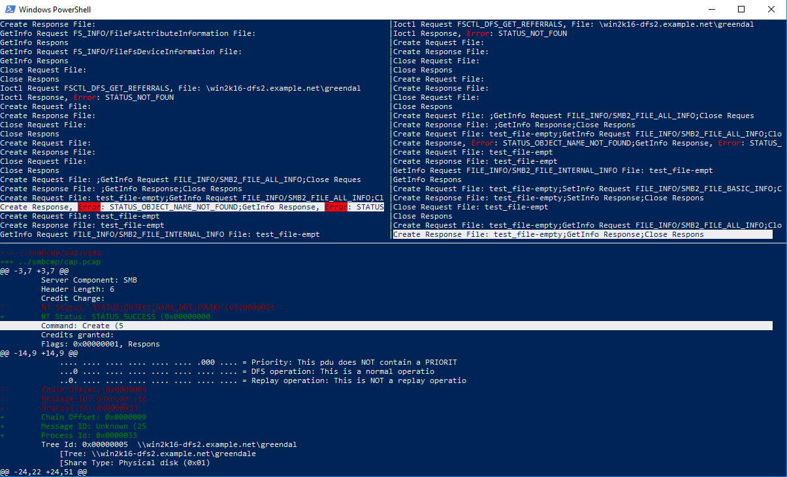
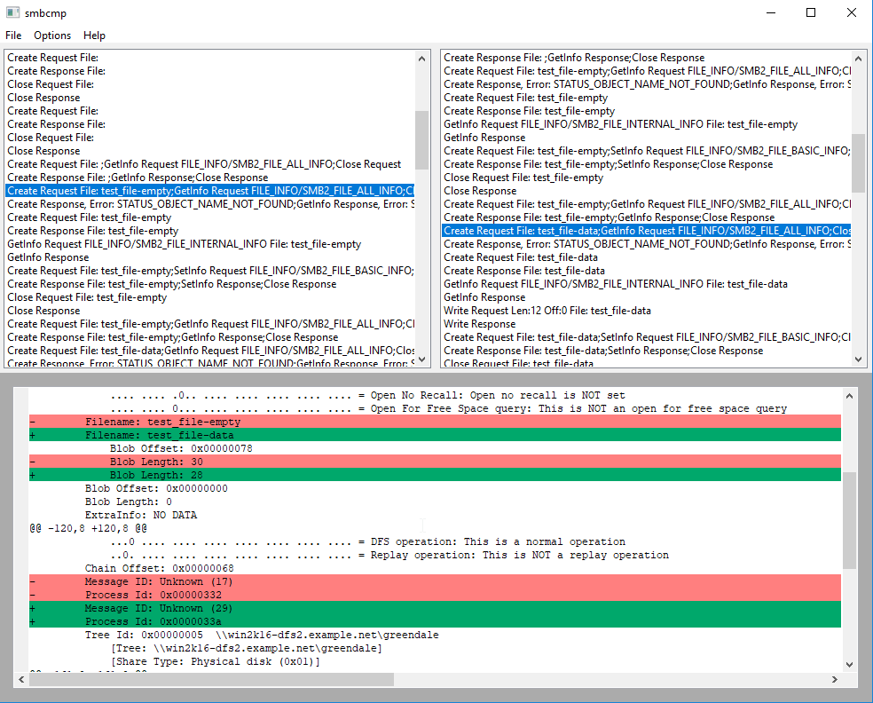
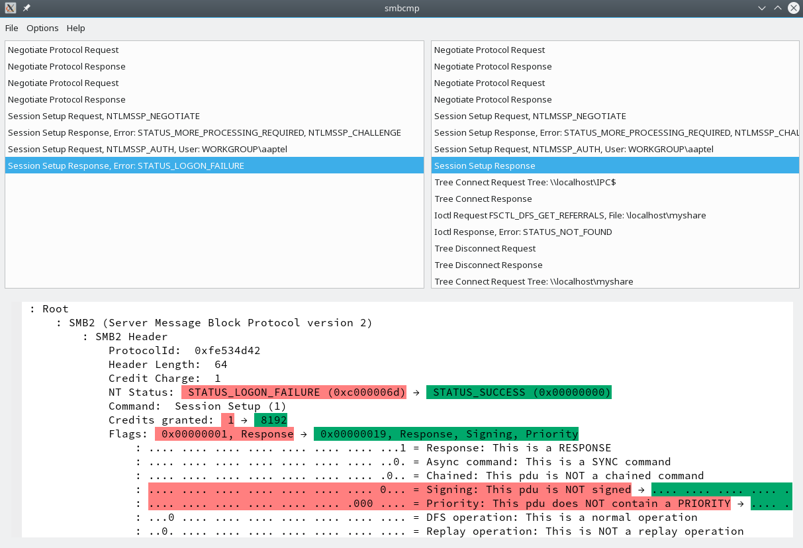

`smbcmp` is a small tool designed to diff and compare network
captures, specifically aimed at SMB traffic. It leverages
[wireshark](https://wireshark.org) to dissect and do deep analysis of
SMB packets and supports SMB1, SMB2 and SMB3.

<asciinema-player src="/demo.cast" cols="78" rows="26"></asciinema-player>

# Screenshots

<table markdown="0"><tr>
<td></td>
<td></td>
<td></td>
</tr>
<tr><td>in a Windows Powershell</td><td>GUI on Windows</td><td>GUI on Linux</td></tr>
</table>

# Features

  * Compare captures side-by-side
  * Ignore specific fields
  * Leverages [Wireshark](https://wireshark.org) for deep analyzing and dissecting:
      * Compares decrypted SMB3 traffic (AES-128-GCM & AES-128-CCM, given keys are available)
      * Compares decompressed traffic (LZ77, LZNT1, LZ77+Huff)
      * Supports SMB1, SMB2, SMB3
      * Supports all sorts of capture format

  * Available on Linux and Windows.
  * [Free and open source](https://github.com/smbcmp/smbcmp) (GPLv3)
  * console version based on ncurses
  * GUI version based on wxWidget

# Contribute

smbcmp is actively developped on Github.

* [github repo](https://github.com/smbcmp/smbcmp)

# Download

## Releases

* [smbcmp v0.1](https://github.com/smbcmp/smbcmp/releases/tag/v0.1)
* Experimental packages for SUSE, RedHat, Debian and Ubuntu systems are available on [OBS](https://software.opensuse.org//download.html?project=home%3Aaaptel%3Asmbcmp&package=smbcmp)
